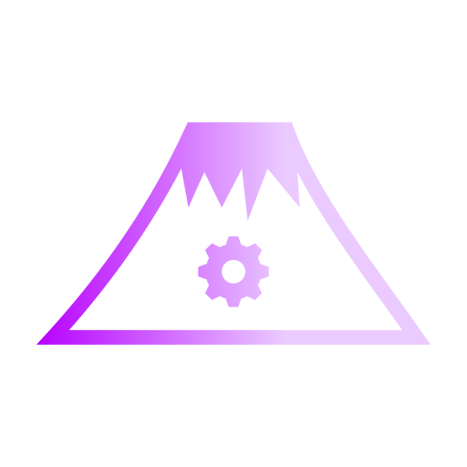

# Fuji: A Celeste 64 Mod Loader

    

Fuji is a basic Mod Loader for <b>Celeste 64: Fragments of the Mountain</b>, a game made by the original Celeste developers in under 2 weeks for Celeste's 6th Anniversary. It is forked from the source code of that game.

### [More info about Fuji can be found here](https://fujiapi.github.io/)
### [We're also on Discord, join us!](https://discord.gg/9NJcbSyuae)

### [The original game can be found here](https://maddymakesgamesinc.itch.io/celeste64)

Fuji is still very early in development, but is currently able to load custom levels alongside the main game, as well as loading additional assets such as custom models, custom dialog, custom textures, etc...
It also implements some new functionality like custom skins, and the ability to load code mods from DLLs.

# Installation
- [Download the latest release here according to your OS.](https://github.com/FujiAPI/Fuji/releases/latest)
- Unzip the project.
- Put your mods into the Mods folder that comes with Fuji.
- Open `Celeste64-Fuji` to start playing!

Fuji does not require the original game's files to run - it is a standalone client. Your vanilla Celeste 64 installation and Fuji installation(s) should not be mixed up.

# Contributing
See the [Contributor's Guide](https://github.com/FujiAPI/Fuji/wiki/Contributing-Guide) for a quick start.

# Building
See [SETUP.md](SETUP.md) for build instructions.

# License
 - The Celeste IP and everything in the `Content` folder are owned by [Maddy Makes Games, Inc](https://www.maddymakesgames.com/).
 - The `Source` folder, with exceptions where noted, is [licensed under MIT](Source/License.txt).
 - The `Source/Audio/FMOD` folder contains bindings and binaries from FMOD.
 - This mod loader is adapted from Celeste 64's Source code, but it is not made or endorsed by the game's creators. 